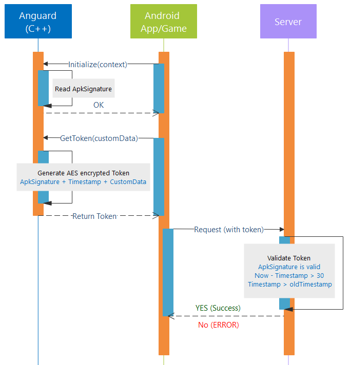

<p align="center"></a></p>
<p align="center">Protect your android app/game against reverse engineering with native .so library.</p>
</br>
<p align="center"></a></p>

Building
-------------------
Replace the [AES key](anguard/jni/Anguard.cpp#L14) with yours
```gradle
gradlew anguard:assembleRelease
```
Unity3D
-------------------
```C#
AndroidJavaClass unityPlayer = new AndroidJavaClass("com.unity3d.player.UnityPlayer");
AndroidJavaObject activity = unityPlayer.GetStatic<AndroidJavaObject>("currentActivity");
AndroidJavaObject context = activity.Call<AndroidJavaObject>("getApplicationContext");
AndroidJavaClass anguardClass = new AndroidJavaClass("com.anguard.Anguard");
anguardClass.CallStatic("initialize", context);
string token = anguardClass.CallStatic<string>("getToken", "");
```
sample project [anguard-unity3d.rar](misc/anguard-unity3d.rar)
### Server
Use this [Method](sample/src/main/java/com/example/MainActivity.java#L39) to decrypt the token at your java backend.
